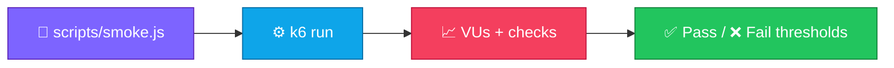

<p align="center">
  
</p>

<h1 align="center">load-testing-k6-starter</h1>

<p align="center">
  <strong>EN</strong> Example k6 smoke script + threshold notes<br/>
  <strong>PT</strong> Script k6 de smoke + notas de thresholds
</p>

<p align="center">
  <a href="https://github.com/manansbdb/load-testing-k6-starter/blob/main/LICENSE"></a>
  
  
  <a href="#support--apoio"></a>
</p>

---

## What it does / Para que serve

| English | Português |
|---------|-----------|
| A starter **k6 smoke script** and threshold guidance for API load testing. | Um **script k6 de smoke** inicial e guia de thresholds para load testing de APIs. |
| Install k6, point the script at your URL, run. | Instala o k6, aponta o script ao teu URL e corre. |



---

## Install / Instalação

### 1) Clone / Clona

```bash
git clone https://github.com/manansbdb/load-testing-k6-starter.git
cd load-testing-k6-starter
```

### 2) Install k6 / Instala o k6

```bash
# macOS
brew install k6
# Debian/Ubuntu example:
# sudo gpg -k && sudo gpg --no-default-keyring --keyring /usr/share/keyrings/k6-archive-keyring.gpg --keyserver hkp://keyserver.ubuntu.com:80 --recv-keys C5B34A480F7F9D63
# Or download from https://k6.io/docs/get-started/installation/
```

### 3) Run / Corre

```bash
k6 run scripts/smoke.js
# edit BASE_URL inside the script (or env) to hit your API
```

### Requirements / Requisitos

- `git`
- [k6](https://k6.io/) installed

---

## Quick start / Início rápido

```bash
git clone https://github.com/manansbdb/load-testing-k6-starter.git
cd load-testing-k6-starter
k6 run scripts/smoke.js
```

---

## Contents / Conteúdos

| Path | Purpose / Função |
|------|------------------|
| `scripts/smoke.js` | k6 smoke script |
| `thresholds.md` | SLA/SLO threshold tips |
| `SUPPORT.md` | Donations / Doações |

---

## Project layout / Estrutura

```text
load-testing-k6-starter/
├── docs/banner.svg
├── scripts/smoke.js
├── thresholds.md
├── SUPPORT.md
└── README.md
```

---

## Support / Apoio

Bitcoin donations welcome / Doações em Bitcoin bem-vindas:

```
bc1q0qfnlnxyum9u45stzxe0a7jnhtj4j0usfkqdjw
```

See [SUPPORT.md](./SUPPORT.md).

---

## License / Licença

[MIT](./LICENSE) © 2026 manansbdb
